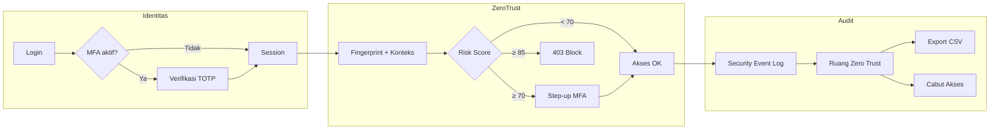

# Panduan Demo & Pengujian Zero Trust — Sidang Tugas Akhir

Dokumen ini panduan praktis untuk **mendemonstrasikan** implementasi Zero Trust Security pada sistem OS-Tiket CSIRT Kalselprov saat **sidang tugas akhir**, sekaligus menjadi **kerangka pengujian** untuk bab metode dan hasil.

**Fokus proyek:** ticketing insiden siber dengan lapisan keamanan Zero Trust (*Never Trust, Always Verify*).

**Referensi teknis di repositori:**

| File | Isi |
|------|-----|
| `ZERO_TRUST_DEFENSES.md` | Arsitektur lapisan pertahanan + diagram alur |
| `LAPORAN_PERBEDAAN_ZERO_TRUST_SEBELUM_SESUDAH.md` | Perbandingan sebelum vs sesudah |
| `config/zero_trust.php` | Saklar dan parameter keamanan |

---

## 1. Apa yang Didemokan ke Penguji

Satu kalimat pembuka:

> *"Setelah login, sistem tidak lagi hanya mengandalkan session cookie. Setiap request dinilai ulang berdasarkan identitas (MFA), perangkat, konteks akses, dan skor risiko — lalu dicatat di audit trail keamanan."*

### Lima pilar Zero Trust yang diimplementasikan

| # | Pilar | Implementasi di OS-Tiket |
|---|--------|---------------------------|
| 1 | **Identitas & MFA** | TOTP (Google Authenticator), backup codes, step-up MFA saat risiko tinggi |
| 2 | **Perangkat & konteks** | Device fingerprint, trust score, jam kerja, GeoIP/GPS, risk score |
| 3 | **Proteksi data** | Lampiran tiket terenkripsi (`.enc`), secret MFA terenkripsi di database |
| 4 | **Verifikasi berkelanjutan** | Middleware `ZeroTrustVerification`, validasi session berkala, auto-logout idle |
| 5 | **Audit & respons insiden** | Ruang Zero Trust, live feed event, export CSV, **Cabut Akses** |

### Alur middleware (urutan eksekusi)

```
Request masuk
  → EnforceAccessRevocation   (cek apakah akses dicabut)
  → CheckUserActivity         (timeout idle 3 menit)
  → RequireMfaVerification    (wajib MFA jika aktif)
  → ZeroTrustVerification     (fingerprint, konteks, risk score, logging)
  → Controller / View
```

---

## 2. Persiapan Sebelum Sidang

### 2.1 URL aplikasi

| Lingkungan | URL |
|------------|-----|
| **Production (Vercel)** | `https://os-tiket-ta-h5k6.vercel.app` |
| **Lokal** | `http://127.0.0.1:8000` atau domain Laragon Anda |

### 2.2 Konfigurasi wajib (`.env`)

Pastikan minimal:

```env
ZERO_TRUST_ENABLED=true
ZERO_TRUST_DEVICE_FINGERPRINTING=true
ZERO_TRUST_MFA_ENABLED=true
ZERO_TRUST_CONTEXT_AWARE=true

SESSION_LIFETIME=3
RISK_SCORE_THRESHOLD_HIGH=70
RISK_SCORE_THRESHOLD_CRITICAL=85
DEVICE_TRUST_SCORE_THRESHOLD=70
```

Setelah mengubah `.env`:

```bash
php artisan config:clear
```

Di Vercel, set variabel yang sama di dashboard Environment Variables, lalu redeploy.

### 2.3 Database & user uji

Jalankan sekali (lokal) atau buka **`/deploy-db`** (Vercel) untuk migrasi:

```
https://os-tiket-ta-h5k6.vercel.app/deploy-db
```

Seed user uji:

```bash
php artisan db:seed --class=RolePermissionSeeder
php artisan db:seed --class=UserSeeder
```

### 2.4 Akun demonstrasi

Semua password default: **`password`**

| Role | Email | Digunakan untuk demo |
|------|-------|----------------------|
| **Super Admin** | `admin@csirt.kalselprov.go.id` | Ruang Zero Trust, export log, Cabut Akses |
| Admin | `admin1@csirt.kalselprov.go.id` | Penugasan tiket, MFA |
| Agent 1 | `agent@csirt.kalselprov.go.id` | Akses agen, GPS, step-up MFA |
| Agent 2 | `agent2@csirt.kalselprov.go.id` | Tab kedua (simulasi korban Cabut Akses) |
| Support Agent | `support@csirt.kalselprov.go.id` | Peran agen alternatif |
| Pelapor (User) | Buat akun baru via register | Portal laporan insiden |

> **Penting:** MFA **belum** aktif otomatis dari seeder. Aktifkan dulu lewat `/profile` → setup MFA **sebelum sidang** (lihat Skenario 1).

### 2.5 Build frontend

GPS dan session monitor membutuhkan asset ter-build:

```bash
npm install
npm run build
```

### 2.6 Materi yang disiapkan di laptop sidang

- [ ] **2 browser** (Chrome + Edge, atau 2 profil Chrome) — untuk demo Cabut Akses
- [ ] **DevTools** (F12) → tab **Network** — untuk bukti GPS
- [ ] Tab **Ruang Zero Trust** sudah login Super Admin
- [ ] Aplikasi **Google Authenticator** (atau Authy) dengan MFA akun uji sudah ter-scan
- [ ] (Opsional) Cuplikan `config/zero_trust.php` di slide
- [ ] (Opsional) Rekaman layar cadangan jika internet bermasalah

### 2.7 Konfigurasi khusus demo (opsional)

Untuk memudahkan memicu **step-up MFA** saat sidang, turunkan sementara ambang risiko di `.env`:

```env
RISK_SCORE_THRESHOLD_HIGH=30
```

Lalu `php artisan config:clear`. **Kembalikan ke `70` setelah demo.**

Picu risiko dengan: login di **luar jam 08:00–17:00** atau di **akhir pekan**.

---

## 3. Naskah Demo Sidang (±15–20 menit)

Urutan dari konsep → bukti visual → respons insiden.

| Menit | Topik | Pembukaan singkat untuk penguji |
|-------|--------|----------------------------------|
| 0–2 | **Konteks** | Jelaskan OS-Tiket + prinsip Zero Trust |
| 2–5 | **MFA login** | Password saja tidak cukup |
| 5–8 | **Verifikasi berkelanjutan** | Browsing → event tercatat |
| 8–10 | **GPS & konteks** | Lokasi browser memperkaya risk score |
| 10–13 | **Ruang Zero Trust** | Dashboard live feed + export CSV |
| 13–16 | **Cabut Akses** | Force logout real-time |
| 16–18 | **Enkripsi lampiran** | Data at-rest terlindungi |
| 18–20 | **Penutup** | Ringkas lima pilar + batasan |

---

## 4. Skenario Pengujian (Langkah Demi Langkah)

### Skenario 1 — Setup & Login MFA

**Tujuan:** Membuktikan verifikasi identitas multi-faktor.

| Langkah | Aksi | Hasil yang diharapkan |
|---------|------|------------------------|
| 1 | Login `agent@csirt.kalselprov.go.id` | Masuk ke halaman login |
| 2 | Buka `/profile` → aktifkan MFA (`/mfa/setup`) | QR code muncul |
| 3 | Scan QR dengan Google Authenticator → `/mfa/enable` | MFA aktif, backup codes ditampilkan |
| 4 | Logout → login ulang | Redirect ke `/mfa/verify` |
| 5 | Masukkan kode TOTP 6 digit | Masuk dashboard agen |

**Bukti untuk penguji:**
- Screenshot halaman MFA verify
- Event `auth_mfa_totp` di Ruang Zero Trust

**Narasi sidang:** *"Ini lapisan identitas — penyerang yang hanya punya password tetap terblokir tanpa perangkat authenticator."*

---

### Skenario 2 — Zero Trust Aktif & Audit Trail

**Tujuan:** Membuktikan verifikasi berkelanjutan dan pencatatan event.

| Langkah | Aksi | Hasil yang diharapkan |
|---------|------|------------------------|
| 1 | Pastikan `ZERO_TRUST_ENABLED=true` | — |
| 2 | Login sebagai Agent → buka `/agent`, `/agent/tickets` | Halaman normal |
| 3 | Login Super Admin → buka `/admin/security-dashboard` | Ruang Zero Trust terbuka |
| 4 | Perhatikan **Live Feed** (refresh otomatis ~60 detik) | Event `access` dari Agent muncul |
| 5 | Klik **Hari Ini** (export CSV) | File CSV terunduh |

**Bukti untuk penguji:**
- Screenshot live feed dengan nama user, IP, risk score
- Buka CSV — kolom: Waktu, Email, Tipe Event, Risk Score, GPS, Device Fingerprint

**Narasi sidang:** *"Setiap navigasi setelah login tidak otomatis dipercaya — sistem mencatat jejak akses untuk audit dan deteksi anomali."*

---

### Skenario 3 — GPS Browser (Konteks Lokasi)

**Tujuan:** Membuktikan integrasi geolokasi untuk analisis konteks.

| Langkah | Aksi | Hasil yang diharapkan |
|---------|------|------------------------|
| 1 | Login sebagai Agent (HP/laptop dengan GPS) | — |
| 2 | Izinkan **Allow location** saat browser meminta | — |
| 3 | Buka DevTools → Network → filter `gps` | Request `POST /zero-trust/gps` status **200** |
| 4 | Response body | `{"status":"ok","gps":{"latitude":...,"longitude":...}}` |
| 5 | Buka Ruang Zero Trust | Koordinat GPS tampil di kartu event |

**Bukti untuk penguji:**
- Screenshot tab Network + response JSON
- Screenshot event dengan GPS di dashboard

**Catatan:** Jika GPS ditolak, sistem tetap jalan — jelaskan sebagai *graceful degradation* (Zero Trust tetap berjalan tanpa GPS).

---

### Skenario 4 — Device Fingerprint & Trust Score

**Tujuan:** Membuktikan identifikasi perangkat.

| Langkah | Aksi | Hasil yang diharapkan |
|---------|------|------------------------|
| 1 | Login dari browser biasa | Perangkat pertama → trust score tinggi (~100) |
| 2 | Login dari **Incognito** atau browser berbeda | Event `device_registered` / verifikasi perangkat |
| 3 | Lihat Ruang Zero Trust | Device fingerprint (hash pendek) + trust % di kartu event |

**Narasi sidang:** *"Sistem membangun fingerprint dari user-agent, IP, dan header — perangkat tidak dikenal menurunkan trust score."*

---

### Skenario 5 — Risk Score & Step-up MFA

**Tujuan:** Membuktikan kontrol berbasis risiko (bukan hanya role).

| Langkah | Aksi | Hasil yang diharapkan |
|---------|------|------------------------|
| 1 | Set sementara `RISK_SCORE_THRESHOLD_HIGH=30` di `.env` | — |
| 2 | `php artisan config:clear` | — |
| 3 | Login Agent **di luar jam 08:00–17:00** atau **Sabtu/Minggu** | Risk score naik (+10 after-hours, +5 weekend) |
| 4 | Navigasi ke `/agent` | Redirect ke `/mfa/verify` (step-up) |
| 5 | Masukkan TOTP | Akses lanjut ke halaman yang dituju |
| 6 | Kembalikan `RISK_SCORE_THRESHOLD_HIGH=70` | — |

**Bukti:** Event `anomaly_detected` / `high_risk` di live feed.

**Catatan implementasi (jujur ke penguji):** Akses di luar jam kerja **tidak langsung diblokir 403** — sistem **mencatat anomaly** dan **menaikkan risk score**, yang dapat memicu step-up MFA sesuai ambang.

---

### Skenario 6 — Cabut Akses (Force Logout)

**Tujuan:** Membuktikan respons insiden — pemutusan sesi aktif oleh Super Admin.

| Langkah | Aksi | Hasil yang diharapkan |
|---------|------|------------------------|
| 1 | **Tab A:** Login `agent2@csirt.kalselprov.go.id` → tetap di `/agent` | Session aktif |
| 2 | **Tab B:** Login Super Admin → `/admin/security-dashboard` | Live feed tampil |
| 3 | Tab B: cari event Agent 2 → klik **Cabut Akses** | Konfirmasi sukses |
| 4 | Tab A: klik menu atau tunggu ~30 detik (session monitor) | Alert + redirect ke `/login` |
| 5 | Tab B: periksa live feed | Event `admin_force_logout` muncul |
| 6 | Tab A: login ulang | Akses kembali normal |

**Narasi sidang:** *"Ini simulasi respons insiden — admin keamanan dapat memutus sesi aktif tanpa menunggu session expired."*

---

### Skenario 7 — Session Timeout (Idle Logout)

**Tujuan:** Membuktikan hardening session.

| Langkah | Aksi | Hasil yang diharapkan |
|---------|------|------------------------|
| 1 | Login sebagai Agent | — |
| 2 | **Diam 3+ menit** tanpa klik apapun | — |
| 3 | Klik menu atau tunggu poll JS (~30 detik) | Redirect ke login |
| 4 | Pesan | *"Session Anda telah berakhir karena tidak ada aktivitas..."* |

**Catatan:** `SESSION_LIFETIME=3` menit. Untuk demo sidang, siapkan timer atau jelaskan dengan rekaman cadangan agar tidak membuang waktu menunggu.

---

### Skenario 8 — Enkripsi Lampiran Tiket

**Tujuan:** Membuktikan proteksi data at-rest.

| Langkah | Aksi | Hasil yang diharapkan |
|---------|------|------------------------|
| 1 | Login sebagai pelapor → buat tiket di `/portal/ticket/new` | — |
| 2 | Upload file lampiran (PDF/gambar) | Tiket terbuat |
| 3 | (Lokal) Cek folder `storage/app/attachments/` | File berakhiran **`.enc`** |
| 4 | Login Agent → buka tiket → unduh lampiran | File terbuka normal (dekripsi on-the-fly) |
| 5 | Ruang Zero Trust | Event `attachment_download_*` tercatat |

**Narasi sidang:** *"File di disk tidak readable meskipun server/storage bocor — dekripsi hanya saat unduh oleh user berwenang."*

---

### Skenario 9 — Perbandingan Sebelum vs Sesudah

**Tujuan:** Menjawab pertanyaan penguji tentang kontribusi Zero Trust.

| Langkah | Aksi | Hasil yang diharapkan |
|---------|------|------------------------|
| 1 | Set `ZERO_TRUST_ENABLED=false` → `config:clear` | — |
| 2 | Login & navigasi | Tidak ada evaluasi risk/fingerprint di middleware ZT |
| 3 | Set `ZERO_TRUST_ENABLED=true` → `config:clear` | — |
| 4 | Ulangi navigasi | Event keamanan muncul di live feed |

Gunakan tabel di `LAPORAN_PERBEDAAN_ZERO_TRUST_SEBELUM_SESUDAH.md` sebagai slide pendukung.

---

## 5. Matriks Pengujian (Untuk Bab Laporan)

Salin ke bab **Metode Pengujian** / **Hasil Pengujian**:

| ID | Skenario | Prasyarat | Langkah | Hasil diharapkan | Status |
|----|----------|-----------|---------|------------------|--------|
| T-01 | Login MFA sukses | MFA aktif di akun uji | Login + TOTP benar | Masuk aplikasi; event auth sukses | ☐ |
| T-02 | Login MFA gagal | MFA aktif | TOTP salah 3× | Ditolak; event gagal | ☐ |
| T-03 | ZT logging aktif | `ZERO_TRUST_ENABLED=true` | Navigasi post-login | Event `access` di dashboard | ☐ |
| T-04 | GPS terkirim | Izin lokasi diizinkan | Login + tunggu | `POST /zero-trust/gps` → 200 | ☐ |
| T-05 | Step-up MFA | Threshold high = 30 | Akses luar jam kerja | Redirect `/mfa/verify` | ☐ |
| T-06 | Cabut Akses | 2 tab browser | Super Admin revoke | Agent logout otomatis | ☐ |
| T-07 | Session idle | Login agent | Diam 3 menit | Auto logout | ☐ |
| T-08 | Enkripsi lampiran | Upload file | Cek storage + unduh | File `.enc`; unduh OK | ☐ |
| T-09 | Export log CSV | Super Admin | Klik "Hari Ini" | CSV berisi event + GPS | ☐ |
| T-10 | ZT disabled | `ZERO_TRUST_ENABLED=false` | Navigasi | Tanpa evaluasi ZT middleware | ☐ |

**Kriteria lulus:** Semua skenario T-01, T-03, T-06, T-08 **lulus** tanpa error 500.

---

## 6. Jawaban Singkat untuk Pertanyaan Penguji

| Pertanyaan | Jawaban singkat |
|------------|-----------------|
| Apa bedanya MFA saja vs Zero Trust? | MFA memverifikasi identitas di awal; Zero Trust **meneruskan penilaian** (perangkat, konteks, risiko) pada **setiap request** dan bisa meminta MFA ulang (step-up). |
| Apakah akses luar jam kerja diblokir? | Tidak hard-block. Sistem **mencatat anomaly** dan **menaikkan risk score**, yang dapat memicu step-up MFA jika melewati ambang. |
| Apa jika `APP_KEY` bocor? | Enkripsi lampiran dan secret MFA bergantung kunci aplikasi — ini mitigasi kebocoran storage/DB, bukan pengganti keamanan server. |
| Kenapa session cuma 3 menit? | Untuk demo keamanan ketat; di produksi bisa disesuaikan via `SESSION_LIFETIME`. |
| Apakah Zero Trust memperlambat aplikasi? | Overhead minimal (cache fingerprint, log async); trade-off wajar untuk audit trail CSIRT. |
| Bagaimana dengan pelapor (user biasa)? | Pelapor tidak akses panel admin; aktivitas portal tetap tercatat jika melalui route yang tidak di-skip middleware. |

---

## 7. Checklist Hari-H Sidang

### Malam sebelum / pagi sidang

- [ ] `ZERO_TRUST_ENABLED=true` di environment demo
- [ ] `php artisan config:clear` (lokal) atau redeploy (Vercel)
- [ ] MFA sudah diaktifkan di minimal 1 akun Agent + 1 Super Admin
- [ ] Password semua akun uji diketahui (`password` atau yang Anda ubah)
- [ ] `npm run build` sudah dijalankan (GPS + session monitor)
- [ ] `/deploy-db` sudah diakses jika deploy Vercel baru
- [ ] Threshold demo (`RISK_SCORE_THRESHOLD_HIGH=30`) sudah diset jika akan demo step-up

### 30 menit sebelum presentasi

- [ ] Buka Tab 1: Super Admin → `/admin/security-dashboard`
- [ ] Buka Tab 2: Agent 2 → `/agent` (untuk demo Cabut Akses)
- [ ] Bersihkan cookie/cache atau gunakan profil terpisah
- [ ] Test koneksi internet ke URL Vercel
- [ ] Siapkan slide arsitektur / diagram dari `ZERO_TRUST_DEFENSES.md`

### Setelah demo

- [ ] Kembalikan `RISK_SCORE_THRESHOLD_HIGH=70` jika sempat diturunkan
- [ ] `php artisan config:clear`

---

## 8. Peta URL Penting

| Fitur | URL | Role |
|-------|-----|------|
| Login | `/login` | Semua |
| Setup MFA | `/mfa/setup` | User login |
| Verifikasi MFA | `/mfa/verify` | User dengan MFA aktif |
| Dashboard Super Admin | `/agent` | Super Admin |
| Ruang Zero Trust | `/admin/security-dashboard` | Super Admin |
| Export log (CSV) | `/admin/api/security-events/export?period=day` | Super Admin |
| Live feed API | `/admin/api/security-events/latest` | Super Admin |
| Cabut Akses | `POST /admin/api/security-events/revoke/{userId}` | Super Admin (via UI) |
| GPS update | `POST /zero-trust/gps` | User login |
| Session check | `GET /session/check` | User login |
| Portal laporan | `/portal/ticket/new` | Pelapor |
| Deploy DB (Vercel) | `/deploy-db` | Publik (sementara) |

---

## 9. Peta File Kode (Ringkas)

| File | Fungsi |
|------|--------|
| `bootstrap/app.php` | Registrasi middleware keamanan |
| `app/Http/Middleware/ZeroTrustVerification.php` | Inti verifikasi berkelanjutan + risk score |
| `app/Http/Middleware/RequireMfaVerification.php` | MFA wajib + step-up |
| `app/Http/Middleware/EnforceAccessRevocation.php` | Cabut akses real-time |
| `app/Http/Middleware/CheckUserActivity.php` | Timeout idle + X-Frame-Options |
| `app/Services/DeviceFingerprintService.php` | Fingerprint & trust score |
| `app/Services/ContextAwareAccessService.php` | Konteks, GeoIP, risk score |
| `app/Services/GpsLocationService.php` | Penyimpanan GPS |
| `app/Services/SecurityEventLogService.php` | Audit trail (file + DB) |
| `app/Services/MfaService.php` | TOTP + enkripsi secret |
| `app/Services/AccessRevocationService.php` | Force logout |
| `app/Services/FileEncryptionService.php` | Enkripsi lampiran |
| `app/Http/Controllers/Admin/SecurityDashboardController.php` | Dashboard + export + revoke |
| `resources/js/geo-location.js` | Kirim GPS ke server |
| `resources/js/session-monitor.js` | Poll session + deteksi revoke |
| `config/zero_trust.php` | Konfigurasi terpusat |

---

## 10. Diagram Alur Demo (Referensi Slide)



---

*Dokumen ini disusun untuk sidang tugas akhir OS-Tiket CSIRT Kalselprov. Sesuaikan tangkapan layar, tanggal pengujian, dan hasil aktual pada bab laporan Anda.*
