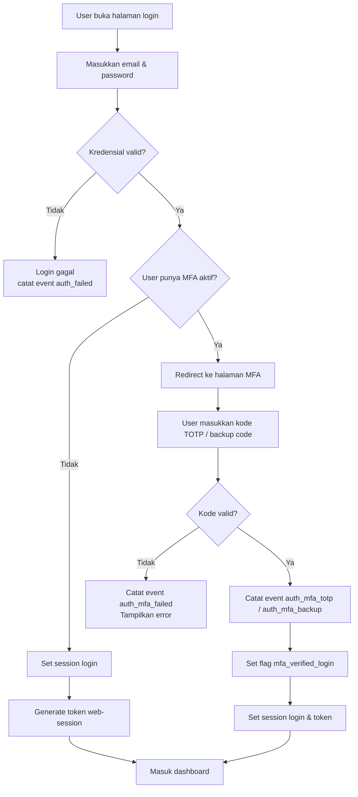
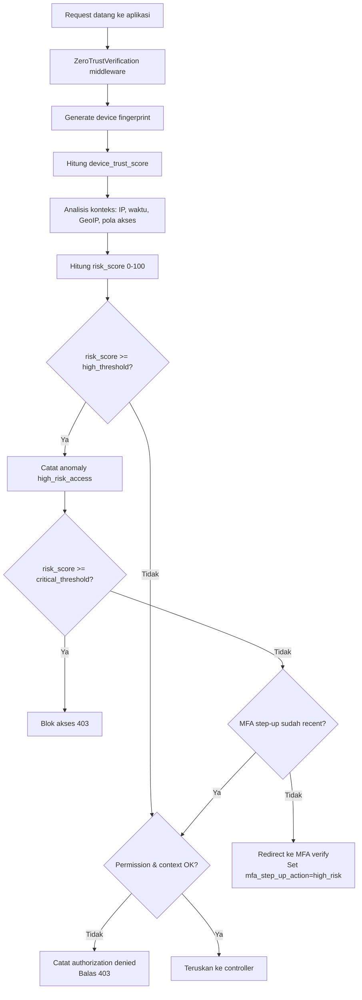
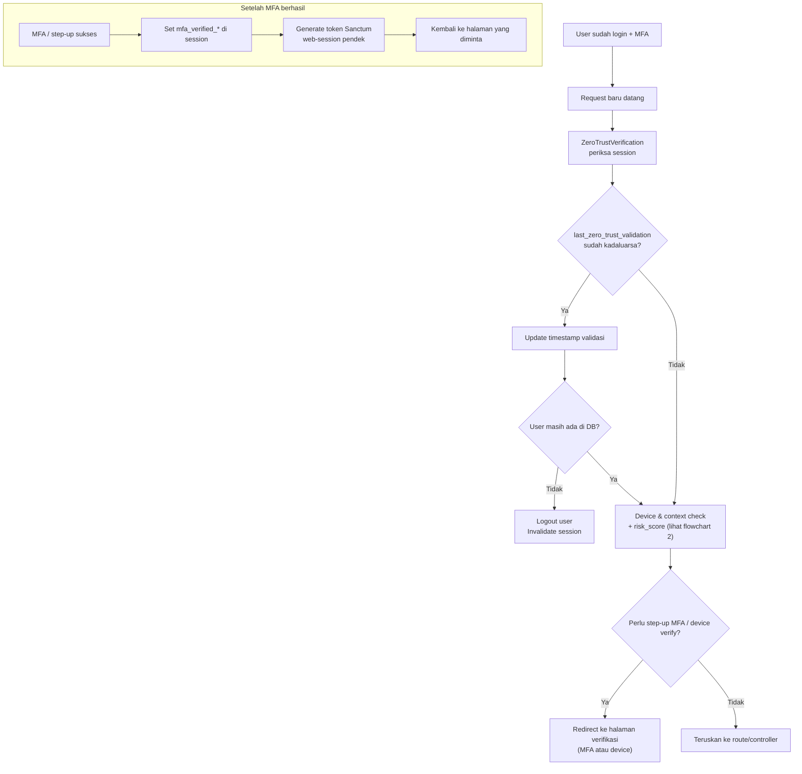
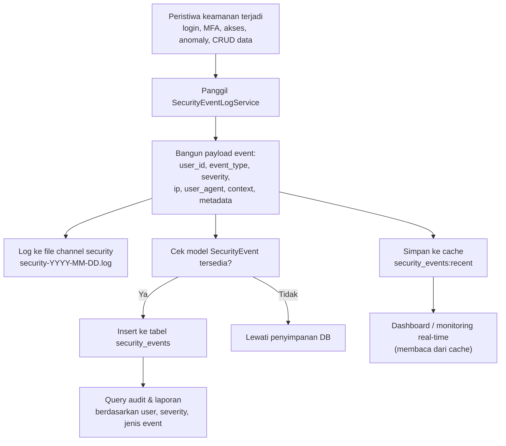

## Ringkasan Lapisan Pertahanan Zero Trust di OS-Tiket

Dokumen ini menjelaskan **bagaimana** tiap komponen Zero Trust di OS‑Tiket melindungi aplikasi, data, dan pengguna. Fokusnya pada lima area utama:

- Identitas & MFA
- Device & context-aware access dengan risk‑based control
- Proteksi data (enkripsi lampiran & secret)
- Continuous verification & session hardening
- Security event logging terpusat

---

### 1. Identitas & MFA

**Tujuan keamanan**

- Memastikan bahwa pengguna yang login **benar‑benar pemilik akun** (bukan hanya tahu password).
- Mengurangi risiko **password bocor / credential stuffing**.

**Mekanisme yang digunakan**

- **MFA TOTP berbasis Google Authenticator / sejenis**  
  Implementasi di `MfaService`, `MfaController`, dan `MfaVerificationController`:
    - Saat setup, sistem menghasilkan **secret TOTP** unik per pengguna dan menampilkan QR code.
    - Saat login, setelah kombinasi email + password benar, user diminta memasukkan **kode TOTP 6 digit** yang hanya berlaku ±30 detik.
    - Kode diverifikasi menggunakan library `pragmarx/google2fa` dengan toleransi waktu terbatas.

- **Backup codes**
    - Sistem membuat beberapa **backup code** satu kali pakai, di‑hash sebelum disimpan.
    - Digunakan jika pengguna kehilangan akses ke aplikasi authenticator, sehingga tetap aman tanpa mematikan MFA.

**Bagaimana ini melindungi aplikasi**

- Penyerang yang berhasil menebak/mencuri password **tetap tidak bisa login** tanpa akses ke perangkat fisik pengguna (HP dengan aplikasi authenticator).
- Kode TOTP yang sangat singkat masa berlakunya **mengurangi dampak** jika kode pernah terlihat oleh pihak lain (shoulder surfing, screenshot, dsb.).
- Backup code mencegah pengguna mematikan MFA sembarangan, sehingga **kebijakan keamanan tetap kuat** tanpa mengorbankan ketersediaan akses.

**Flowchart Identitas & MFA**

---

### 2. Device & Context-Aware Access dengan Risk‑Based Control

**Tujuan keamanan**

- Menilai **seberapa “wajar”** sebuah akses berdasarkan **perangkat, lokasi, IP, dan pola perilaku**.
- Menolak atau memperketat akses ketika konteksnya **mencurigakan** meskipun kredensial benar.

**Mekanisme yang digunakan**

- **Device fingerprinting & trust score** (`DeviceFingerprintService`)
    - Sistem membangun **fingerprint perangkat** dari kombinasi user‑agent, IP, header, resolusi layar, timezone, dan informasi lain.
    - Fingerprint disimpan di cache (dan bisa disimpan di tabel `device_fingerprints`) dengan metadata seperti waktu registrasi, last seen, dan **device trust score**.
    - Setiap request dihitung ulang **trust score**‑nya berdasarkan:
        - Apakah perangkat sudah dikenal.
        - Sudah berapa lama perangkat digunakan.
        - Seberapa sering perangkat digunakan.
        - Apakah IP atau user‑agent berubah drastis.

- **Context‑aware access** (`ContextAwareAccessService`)
    - Menganalisis konteks akses: IP, user‑agent, waktu (jam & hari), weekend, timezone, pola akses sebelumnya, dan (opsional) **lokasi geografis dari GeoIP**.
    - Menerapkan aturan:
        - Admin/agent hanya boleh akses **jam kerja**, kecuali punya izin khusus akses di luar jam kerja.
        - Memblokir akses dari negara yang tidak termasuk `ALLOWED_COUNTRIES` (jika GeoIP aktif).
        - Memblokir IP yang ada di `BLOCKED_IPS` atau di luar whitelist tertentu.
    - Menghitung **risk score** 0–100 berdasarkan kombinasi faktor di atas.

- **Risk‑based step‑up authentication** (`ZeroTrustVerification`)
    - Jika `risk_score` melewati ambang “tinggi”, middleware:
        - Mencatat **anomaly event**.
        - Mengarahkan user ke halaman MFA untuk **verifikasi ulang (step‑up)** sebelum melanjutkan.
    - Jika `risk_score` melewati ambang “kritis”, akses langsung **ditolak (403)** walaupun user sudah login.

**Bagaimana ini melindungi aplikasi**

- Login dari perangkat/negara/waktu yang tidak biasa **tidak langsung dipercaya**, walaupun email + password benar.
- Akses admin yang berisiko tinggi dipaksa melakukan **MFA ulang**, sehingga serangan dari sesi yang dicuri jauh lebih sulit.
- Kombinasi device fingerprint + lokasi + waktu membuat penyerang harus **meniru banyak aspek sekaligus**, bukan hanya kredensial.

**Flowchart Device & Context-Aware Access**

---

### 3. Proteksi Data (Enkripsi Lampiran & Secret)

**Tujuan keamanan**

- Melindungi **data sensitif** (lampiran tiket, secret MFA) agar tetap aman walaupun storage server diakses pihak tidak berwenang.

**Mekanisme yang digunakan**

- **Enkripsi lampiran tiket** (`FileEncryptionService`, `AttachmentController`)
    - Setiap file lampiran yang di‑upload:
        - Dibaca isinya di server.
        - Dienkripsi menggunakan **Laravel Crypt** yang berbasis **AES‑256** (mis. `AES-256-CBC`).
        - Disimpan sebagai file `.enc` di storage lokal, dengan metadata di tabel `lampiran` (`is_encrypted`, `original_filename`, `path`, dll.).
    - Saat user yang berhak mengunduh lampiran:
        - File `.enc` didekripsi **on‑the‑fly** di server.
        - Hasil dekripsi dikirim sebagai stream HTTP; isi aslinya **tidak pernah disimpan kembali** dalam bentuk plaintext di disk.
    - Ada guard yang memastikan konfigurasi cipher aplikasi harus bertipe **AES‑256**; jika tidak sesuai, proses enkripsi/dekripsi akan gagal dengan error jelas.

- **Enkripsi secret MFA & data sensitif user**
    - Secret TOTP (`mfa_secret`) **tidak disimpan plaintext**; sebelum dicatat ke database, nilai ini dienkripsi dengan mekanisme enkripsi Laravel.
    - Saat diperlukan untuk verifikasi, secret didekripsi sementara di memori, lalu segera digunakan dan tidak diekspos ke luar.

**Bagaimana ini melindungi aplikasi**

- Jika terjadi kebocoran akses ke file system (mis. backup storage atau disk dicuri), konten lampiran **tetap tidak bisa dibaca** tanpa `APP_KEY` yang benar.
- Secret MFA yang terenkripsi mencegah admin basis data atau penyerang yang mengakses DB **menghitung ulang kode TOTP** pengguna.

**Flowchart Proteksi Data (Lampiran & Secret)**

```mermaid
flowchart TD
    subgraph Upload Lampiran
        A[User kirim form dengan file] --> B[Controller terima file]
        B --> C["FileEncryptionService.storeEncrypted()"]
        C --> D["Enkripsi konten dengan AES-256\nCrypt::encrypt()"]
        D --> E[Simpan file .enc di storage]
        E --> F[Simpan metadata ke tabel lampiran\npath, is_encrypted=true]
    end

    subgraph Download Lampiran
        G[User minta download lampiran] --> H[Controller cek hak akses tiket]
        H --> I{is_encrypted?}
        I -- Ya --> J["FileEncryptionService.getDecrypted()"]
        J --> K[Stream isi plaintext ke response]
        I -- Tidak --> L[Baca file asli dari disk\nStream ke response]
    end

    subgraph Secret MFA
        M[Enable MFA] --> N[Generate secret TOTP]
        N --> O[Encrypt secret]
        O --> P[Simpan ke kolom mfa_secret terenkripsi]
        Q[Verifikasi TOTP] --> R[Decrypt mfa_secret sementara]
        R --> S[Validasi kode TOTP]
    end
```

---

### 4. Continuous Verification & Session Hardening

**Tujuan keamanan**

- Tidak menganggap sesi yang sudah terbentuk sebagai **selamanya tepercaya**.
- Mengurangi waktu bagi penyerang untuk menyalahgunakan sesi yang dicuri (session hijacking).

**Mekanisme yang digunakan**

- **Middleware ZeroTrustVerification** berjalan pada setiap request web yang sudah login:
    - Memastikan **user masih valid** di database (mis. akun tidak dihapus / dinonaktifkan).
    - Menyimpan waktu validasi terakhir di session dan melakukan re‑validasi berkala (`SESSION_VALIDATION_INTERVAL`).
    - Mengkombinasikan verifikasi identitas (MFA), device, dan konteks akses secara berulang.

- **Token sesi yang lebih ketat**
    - Setelah MFA berhasil, sistem membuat **token Sanctum** dengan masa berlaku sangat pendek dan menyimpannya di session.
    - Session juga menyimpan `last_activity` sehingga aplikasi bisa menerapkan kebijakan **auto logout** setelah periode tidak aktif tertentu (via middleware lain).

**Bagaimana ini melindungi aplikasi**

- Jika session cookie dicuri, penyerang tetap harus melewati beberapa lapisan:
    - Validasi ulang Zero Trust (device, konteks).
    - Token yang pendek umurnya.
    - MFA ulang saat risk score tinggi.
- Sesi yang tidak aktif atau user yang tidak lagi valid bisa **diputus lebih cepat**, memperkecil jendela waktu serangan.

**Flowchart Continuous Verification & Session Hardening**

---

### 5. Security Event Logging Terpusat

**Tujuan keamanan**

- Memberikan **jejak audit lengkap** untuk semua aktivitas penting yang berkaitan dengan keamanan.
- Memungkinkan **monitoring dan analisis insiden** secara terpusat.

**Mekanisme yang digunakan**

- **Tabel `security_events` dan model `SecurityEvent`**
    - Menyimpan event seperti:
        - `auth_login`, `auth_failed`, `auth_mfa_totp`, `auth_mfa_backup_code`
        - `authorization_check` (grant/deny)
        - `device_registered`, `anomaly_detected`, `access` biasa, dsb.
    - Setiap record menyertakan:
        - `user_id` (boleh null untuk tamu)
        - `ip_address`, `user_agent`, **`device_fingerprint`**
        - `context` (JSON: method, path, lokasi GeoIP, dsb.)
        - `metadata` tambahan (misalnya skor kepercayaan device)
        - `risk_score` dan `created_at` untuk analisis kronologis.

- **`SecurityEventLogService` sebagai pusat logging**
    - Memberikan API standar:
        - `logEvent()` untuk event generik.
        - `logAuthentication()`, `logAuthorization()` untuk authZ/authN.
        - `logDeviceEvent()`, `logAnomaly()` untuk device & anomaly.
        - `logActivity()` untuk CRUD resource (Ticket, User, dll.).
    - Setiap pemanggilan akan secara otomatis:
        - Menulis baris ke **file log kanal `security`** (`storage/logs/security-YYYY-MM-DD.log`).
        - Menyimpan event di cache untuk dashboard real‑time.
        - Menyimpan event ke tabel `security_events` untuk keperluan audit jangka panjang.

- **Logging spesifik aksi sensitif**
    - Download lampiran, perubahan tiket penting, dan akses admin akan menghasilkan event sendiri dengan konteks rinci.

**Bagaimana ini melindungi aplikasi**

- Administrator dapat dengan cepat **melihat pola aneh**: banyak gagal login, akses dari negara tak biasa, atau lonjakan high‑risk access.
  -.Jika terjadi insiden (mis. kebocoran data), log memberikan **bukti kuat** tentang kapan, dari mana, dan siapa yang mengakses data.
- Data log dapat digunakan untuk **menyempurnakan aturan Zero Trust** (mis. memperbarui daftar negara/IP yang diblokir, atau menyesuaikan threshold risk score).

**Flowchart Security Event Logging Terpusat**

---

### Penutup

Lima lapisan di atas bekerja **bersama‑sama**:

- Identitas & MFA memastikan **siapa** yang mengakses.
- Device & context‑aware access memastikan **dari mana dan bagaimana** akses dilakukan.
- Enkripsi data memastikan bahwa jika storage / database bocor, **datanya tetap tidak terbaca**.
- Continuous verification memastikan sesi yang sudah terbentuk **tetap diawasi** sepanjang waktu.
- Security event logging memberikan **visibilitas penuh** dan dasar pengambilan keputusan untuk peningkatan keamanan berikutnya.

Kombinasi ini menjadikan OS‑Tiket selaras dengan prinsip Zero Trust: **“Never Trust, Always Verify”** dalam setiap lapisan arsitektur.
